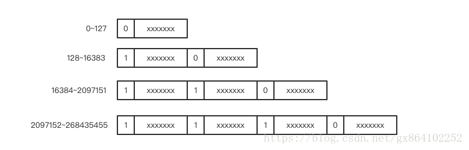

# RPC消息协议设计

### 深入理解RPC消息协议设计
对于一串消息流，我们必须能确定消息边界，提取出单条消息的字节流片段，然后对这个片段按照一定的规则进行反序列化来生成相应的消息对象。

### 消息边界
RPC 需要在一条 TCP 链接上进行多次消息传递。在连续的两条消息之间必须有明确的分割规则，以便接收端可以将消息分割开来，这里的接收端可以是 RPC 服务器接收请求，也可以是 RPC 客户端接收响应。

基于 TCP 链接之上的单条消息如果过大，就会被网络协议栈拆分为多个数据包进行传送。如果消息过小，网络协议栈可能会将多个消息组合成一个数据包进行发送。对于接收端来说它看到的只是一串串的字节数组，如果没有明确的消息边界规则，接收端是无从知道这一串字节数组究竟是包含多条消息还是只是某条消息的一部分。

比较常用的两种分割方式是特殊分割符法和长度前缀法。


消息发送端在每条消息的末尾追加一个特殊的分割符，并且保证消息中间的数据不能包含特殊分割符。比如最为常见的分割符是\r\n。当接收端遍历字节数组时发现了\r\n，就立即可以断定\r\n 之前的字节数组是一条完整的消息，可以传递到上层逻辑继续进行处理。HTTP 和 Redis 协议就大量使用了\r\n 分割符。此种消息一般要求消息体的内容是文本消息。


消息发送端在每条消息的开头增加一个 4 字节长度的整数值，标记消息体的长度。这样消息接受者首先读取到长度信息，然后再读取相应长度的字节数组就可以将一个完整的消息分离出来。此种消息比较常用于二进制消息。

基于特殊分割符法的优点在于消息的可读性比较强，可以直接看到消息的文本内容，缺点是不适合传递二进制消息，因为二进制的字节数组里面很容易就冒出连续的两个字节内容正好就是\r\n 分割符的 ascii 值。如果需要传递的话，一般是对二进制进行 base64编码转变成普通文本消息再进行传送。

基于长度前缀法的优点和缺点同特殊分割符法正好是相反的。长度前缀法因为适用于二进制协议，所以可读性很差。但是对传递的内容本身没有特殊限制，文本和内容皆可以传输，不需要进行特殊处理。HTTP 协议的 Content-Length 头信息用来标记消息体的长度，这个也可以看成是长度前缀法的一种应用。
```html
HTTP/1.0 200 OK
Server: SimpleHTTP/0.6 Python/2.7.13
Date: Thu, 10 May 2018 02:38:03 GMT
Content-type: text/html; charset=utf-8
Content-Length: 10393
# 此处省略 10393 字节消息体数据
```
HTTP 协议是一种基于特殊分割符和长度前缀法的混合型协议。比如 HTTP 的消息头采用的是纯文本外加\r\n 分割符，而消息体则是通过消息头中的 Content-Type 的值来决定长度。HTTP 协议虽然被称之为文本传输协议，但是也可以在消息体中传输二进制数据数据的，例如音视频图像，所以 HTTP 协议被称之为「超文本」传输协议。

### 消息的结构
例如Json协议就是直接通过内容体现。
json 这种直观的消息协议的可读性非常棒，但是它的缺点也很明显，有太多的冗余信息。比如每个字符串都使用双引号来界定边界，key/value 之间必须有冒号分割，对象之间必须使用大括号分割等等。这些还只是冗余的小头，最大的冗余还在于连续的多条 json 消息即使结构完全一样，仅仅只是 value 的值不一样，也需要发送同样的 key 字符串信息。

消息的结构在同一条消息通道上是可以复用的，比如在建立链接的开始 RPC 客户端和服务器之间先交流协商一下消息的结构，后续发送消息时只需要发送一系列消息的 value 值，接收端会自动将 value 值和相应位置的 key 关联起来，形成一个完成的结构消息。在 Hadoop 系统中广泛使用的 avro 消息协议就是通过这种方式实现的，在 RPC 链接建立之处就开始交流消息的结构，后续消息的传递就可以节省很多流量。

消息的隐式结构一般是指那些结构信息由代码来约定的消息协议，在 RPC 交互的消息数据中只是纯粹的二进制数据，由代码来确定相应位置的二进制是属于哪个字段。

### 消息压缩
如果消息的内容太大，就要考虑对消息进行压缩处理，这可以减轻网络带宽压力。但是这同时也会加重 CPU 的负担，因为压缩算法是 CPU 计算密集型操作，会导致操作系统的负载加重。所以，最终是否进行消息压缩，一定要根据业务情况加以权衡。

如果确定压缩，那么在选择压缩算法包时，务必挑选那些底层用 C 语言实现的算法库，因为 Python 的字节码执行起来太慢了。比较流行的消息压缩算法有 Google 的 snappy 算法，它的运行性能非常好，压缩比例虽然不是最优的，但是离最优的差距已经不是很大。阿里的 SOFA RPC 就使用了 snappy 作为协议层压缩算法。

### 流量的极致优化
开源的流行 RPC 消息协议往往对消息流量优化到了极致，它们通过这种方式来打动用户，吸引用户来使用它们。比如对于一个整形数字，一般使用 4 个字节来表示一个整数值。

但是经过研究发现，消息传递中大部分使用的整数值都是很小的非负整数，如果全部使用 4 个字节来表示一个整数会很浪费。所以就发明了一个类型叫变长整数varint。数值非常小时，只需要使用一个字节来存储，数值稍微大一点可以使用 2 个字节，再大一点就是 3 个字节，它还可以超过 4 个字节用来表达长整形数字。

其原理也很简单，就是保留每个字节的最高位的 bit 来标识是否后面还有字节，1 表示还有字节需要继续读，0 表示到读到当前字节就结束。


那如果是负数该怎么办呢？-1 的 16 进制数是 0xFFFFFFFF，如果要按照这个编码那岂不是要 6 个字节才能存的下。-1 也是非常常见的整数啊。

于是 zigzag 编码来了，专门用来解决负数问题。zigzag 编码将整数范围一一映射到自然数范围，然后再进行 varint 编码。
```
0 => 0
-1 => 1
1 => 2
-2 => 3
2 => 4
-3 => 5
3 => 6
```
zigzag 将负数编码成正奇数，正数编码成偶数。解码的时候遇到偶数直接除 2 就是原值，遇到奇数就加 1 除 2 再取负就是原值。

### 练习题
自己实现一下 varint 和 zigzag 编码转换器。
```python
# zigzag
def zigzag_encode(x):
    return x * 2 if x >= 0 else -2 * x - 1

def zigzag_decode(x):
    # x & 1 判断奇偶
    # (x+1) >> 1 除以2
    return x >> 1 if not x & 1 else -1 * (x+1) >> 1

# varint
def varint_encode(x):
    result = 0
    tail = x & 0x7f # 保留低位

    i = 1
    r = x >> 7      # 隔7位取
    while r > 0:
        n = (r & 0x7f) | 0x80   # 7bit高位加1bits
        result |= n << (8 * i)
        r = r >> 7
        i += 1

    return result | tail

def varint_decode(x):
    result = 0
    tail = x & 0xff

    i = 1
    r = x >> 8
    while r > 0:
        n = r & 0x7f
        result |= n << (7 * i)
        r = r >> 8
        i += 1

    return result | tail
```